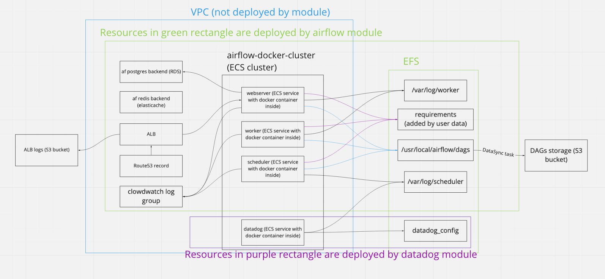

## Terraform airflow module
Fully equipped AirFlow service on AWS, as simple to run as possible. Airflow cluster
created by this module is NOT intended to be used for heavy lifting, main purpose
is to trigger services managed by AWS. Default configurations are for educational
purposes and are the most simple to start with. More information about this module
can be found in [docs.](./docs/index.md)

#### Architecture overview

This root module deploys everything that is inside the green rectangle.

#### What is NOT deployed by current module (prerequisites):
1. S3 bucket for Terraform config backend (tfstate)
2. Dynamo table with LockID primary key (Used for tfstate locking) 
3. DAGs storage (S3 bucket)
4. S3 bucket (Amazon S3-Managed Encryption Keys (SSE-S3) is used) for load balancer
    access logs (Remember to enable  access logs on the load balancer) see
    [AccessControl](https://docs.aws.amazon.com/elasticloadbalancing/latest/application/load-balancer-access-logs.html)
    Use the following string LB Access Logs S3 Location
    lb-logs-bucket-name-comes-here/logs-lb-airflow
5. VPC AirFlow resides in
7. Make sure the IAM user your terraform is using has all the required permissions (EC2,S3, ElastiCache, etc.)
8. DNS zone (Route53) and SSL certificate (ACM)
9. Key pair for SSH access to ECS EC2 instances

#### TODOs
1. Add tests:
    * that DAGs are picked up from AWS S3
    * that DAGs can run
    * that logs for DAGs appear
    * that webserver responds
2. Check if adjusting of name variable is enough to run multiple AF clusters in one
    account
3. Further improvements: configure autoscaling for worker task